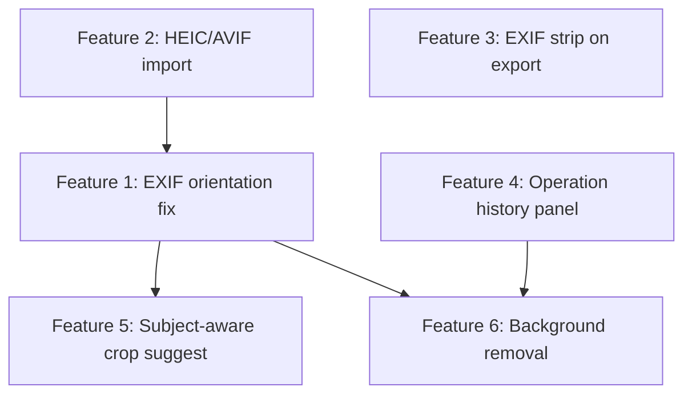

# JustCropIt — Feature Implementation Plan

This document is the **single source of truth** for planned features. All other feature ideas are out of scope unless added here explicitly.

## Scope (6 features)

| # | Feature | Phase |
|---|---------|-------|
| 1 | EXIF orientation fix on import | 1 |
| 2 | HEIC/AVIF import | 1 |
| 3 | Optional EXIF strip on export | 2 |
| 4 | Operation history panel | 3 |
| 5 | Subject-aware crop suggest | 4 |
| 6 | Background removal (on-device) | 5 |

---

## Architecture context

Understanding where these features plug in:

```
Upload flow:     PhotoGrid input → App.vue handleUpload → photoStorage (IndexedDB)
Edit flow:       PhotoCard / batch toolbar → App.vue handlers → imageWorkerPool / canvas
Crop UI:         CropModal.vue (vue-advanced-cropper)
Undo/redo:       UndoRedoManager + Command classes (Flip, Crop, Paste, Batch)
Download:        handleDownload / handleBatchDownload (JSZip)
Workers:         imageWorker.ts, imageWorkerPool.ts, videoWorker.ts
Photo model:     types/photo.ts — original, current, crop, flips, rotation
```

All six features must remain **100% client-side** (no uploads, no accounts).

---

## Feature 1: EXIF orientation fix on import

### What it does

Reads EXIF Orientation (values 1–8) when a photo is uploaded and **physically rotates/flips the pixel data** so the stored `original` image is visually upright. After normalization, crop coordinates, thumbnails, and copy/paste settings all match what the user sees.

### Why it matters

Phone photos (especially iPhone) often store raw pixels in one orientation while EXIF says “display rotated.” Browsers may correct this for `` preview but canvas-based crop math in `applyFlipsRotationAndCrop` (App.vue) operates on raw dimensions — causing crops to land in the wrong place and breaking batch paste consistency.

### User experience

- Upload looks correct immediately in the grid and crop modal.
- No extra user action required.
- If EXIF is missing or already upright (orientation 1), file passes through unchanged.

### Implementation plan

#### New files

| File | Purpose |
|------|---------|
| `src/utils/exifReader.ts` | Parse EXIF orientation from JPEG/TIFF APP1 segment (or thin wrapper around `exifr`) |
| `src/utils/exifOrientation.ts` | Map orientation tag → canvas transform (1–8), apply to `ImageBitmap` / canvas |
| `src/utils/normalizeImageOnImport.ts` | Orchestrator: read EXIF → apply transform → return normalized `Blob` + `File` |

#### Files to modify

| File | Change |
|------|--------|
| `src/App.vue` (`handleUpload`) | Run `normalizeImageOnImport(file)` **before** `savePhoto`, thumbnail generation, and thumbhash |
| `src/utils/photoStorage.ts` | Optionally store `metadata.exifNormalized: true` for debugging |
| `src/types/photo.ts` | No schema change required; normalized file becomes `original` |

#### Technical details

1. **When to run:** First step inside the per-file upload chunk in `handleUpload` (before `createThumbnailFromFile`).
2. **Supported formats:** JPEG primary target; PNG/WebP typically lack orientation tags (no-op).
3. **Transform approach:** Draw source image to canvas with the correct `translate` / `rotate` / `scale` for the orientation value, then `canvas.toBlob()` into a new upright JPEG/PNG matching original mime where possible.
4. **Worker option:** For large batches, run normalization in `imageWorker.ts` as a new request type `'normalize'` to avoid main-thread jank. Start on main thread for Phase 1 simplicity; move to worker if profiling shows upload stalls.
5. **Dimension swap:** Orientations 5–8 swap width/height; ensure returned `File` reflects new dimensions so `crop` coordinates stay in pixel space of the stored image.

#### Acceptance criteria

- [ ] iPhone portrait JPEG imports upright in grid and crop modal without manual rotation.
- [ ] Crop applied after import matches visual selection.
- [ ] Copy/paste settings between two normalized photos with same dimensions produce identical output.
- [ ] Photos without EXIF orientation upload unchanged.

---

## Feature 2: HEIC/AVIF import

### What it does

Accepts `.heic`, `.heif`, and `.avif` files on upload, decodes them in the browser, and converts to a standard format (JPEG recommended) before entering the normal photo pipeline.

### Why it matters

`PhotoGrid.vue` file inputs use `accept="image/*"`, but many browsers cannot decode HEIC into something `createImageBitmap` or canvas can process. iPhone users are forced to convert externally before using JustCropIt.

### User experience

- User drops HEIC/AVIF files alongside JPEG/PNG.
- Brief per-file or batched “Converting…” indicator during upload.
- Converted photos appear in the grid like any other upload.
- Original filename preserved with updated extension (e.g. `IMG_1234.heic` → `IMG_1234.jpg`).

### Implementation plan

#### Dependencies (evaluate during implementation)

| Library | Use case |
|---------|----------|
| `heic2any` | HEIC → JPEG/Blob in browser (WASM) |
| Native `createImageBitmap` | AVIF on Chrome/Firefox/Edge (no extra lib) |

#### New files

| File | Purpose |
|------|---------|
| `src/utils/formatDetector.ts` | Detect HEIC/HEIF/AVIF by extension and/or magic bytes |
| `src/utils/imageDecoder.ts` | `decodeToJpeg(file): Promise<File>` — routes HEIC vs AVIF paths |
| `src/workers/decodeWorker.ts` (optional) | Heavy WASM decode off main thread |

#### Files to modify

| File | Change |
|------|---------|
| `src/App.vue` (`handleUpload`) | Before EXIF normalization: `if (isHeicOrAvif(file)) file = await decodeToJpeg(file)` |
| `src/components/PhotoGrid.vue` | Extend `accept` to `image/*,.heic,.heif,.avif` for explicit picker support |
| `src/constants/optimization.ts` | Add `UPLOAD_DECODE_CHUNK_SIZE` if decode is slower than thumb generation |

#### Pipeline order (per file)

```
raw file → format detect → HEIC/AVIF decode (if needed) → EXIF normalize → thumbnail + thumbhash → savePhoto
```

#### Technical details

1. **Storage format:** Store decoded JPEG as `original` in IndexedDB to reduce size vs raw HEIC and simplify downstream canvas ops.
2. **Quality:** Default JPEG quality 0.92; tunable constant in `constants/optimization.ts`.
3. **Memory:** Decode one file at a time inside existing `processInChunks` upload loop; do not decode entire batch in parallel.
4. **Lazy WASM load:** Load `heic2any` only on first HEIC upload (dynamic `import()`) to keep initial bundle small.
5. **Error handling:** If decode fails, show `StorageAlert` with filename and skip file; do not block rest of batch.

#### Acceptance criteria

- [ ] iPhone HEIC photos upload and display in grid.
- [ ] AVIF uploads work on browsers with native AVIF decode.
- [ ] Decoded files pass through EXIF normalization (Feature 1).
- [ ] First app load without HEIC uploads does not download WASM decoder.

---

## Feature 3: Optional EXIF strip on export

### What it does

Gives users a choice when downloading (single or ZIP): **keep metadata** or **strip EXIF** (GPS, device info, timestamps, etc.) from exported files.

### Why it matters

JustCropIt is privacy-first. Even though images never leave the device during editing, a downloaded JPEG can still contain GPS and camera serial in EXIF. Users exporting batch crops for sharing need a one-click way to remove that.

### User experience

- Toggle in batch toolbar or download confirmation: **“Strip metadata on export”** (default: ON for privacy, or OFF to match today’s behavior — decide during UX pass).
- Applies to single download and ZIP batch download.
- Video frame exports out of scope unless extended later.

### Implementation plan

#### New files

| File | Purpose |
|------|---------|
| `src/utils/exifStrip.ts` | `stripMetadata(blob, mimeType): Promise<Blob>` — canvas re-encode (drops EXIF) or library-based tag removal |
| `src/composables/useExportSettings.ts` | Persist `stripExifOnExport` preference in `sessionStorage` |

#### Files to modify

| File | Change |
|------|---------|
| `src/App.vue` | `handleDownload` / `handleBatchDownload`: if strip enabled, run `stripMetadata` on blob before `a.download` / `zip.file` |
| `src/components/PhotoGrid.vue` | Add toggle in Actions section of batch toolbar |
| `src/types/photo.ts` or settings type | Export preference type |

#### Technical details

1. **Strip path (default implementation):** Canvas pipeline already produces clean blobs for cropped images. For **uncropped** originals downloaded via Revert state, pipe through `canvas.toBlob` to guarantee no EXIF carry-over.
2. **Preserve path (opt-in):** Use `piexifjs` or `exifr` to read EXIF from `photo.original` and re-inject safe tags (copyright, artist) onto the exported blob. Skip GPS entirely even on “preserve” unless user explicitly opts into location (future).
3. **ZIP:** Strip per file inside existing chunked loop in `handleBatchDownload` (parallel with buffer read).
4. **Performance:** Stripping via canvas re-encode is acceptable for export (user expects brief wait); reuse `imageWorkerPool` only if batch ZIP strip is slow on 100+ files.

#### Acceptance criteria

- [ ] Downloaded file with strip ON contains no EXIF GPS or device tags (verify with exiftool or browser EXIF viewer).
- [ ] ZIP batch download respects the same toggle.
- [ ] Preference persists for the browser session.
- [ ] Cropped exports behave identically visually with strip ON.

---

## Feature 4: Operation history panel

### What it does

A visible UI panel listing every editing operation in the session — crop, flip, paste settings, batch actions — with timestamps and human-readable labels. Users can see what happened and jump to a prior state (undo to that point).

### Why it matters

Batch paste to dozens of photos is powerful but opaque. The existing `UndoRedoManager` already tracks commands with `getDescription()` but exposes them only via Ctrl+Z / Ctrl+Y with no visibility.

### User experience

- Collapsible panel (sidebar or bottom sheet on mobile): **“History”**.
- Newest action at top; current undo position highlighted.
- Click an entry → undo repeatedly until that entry is the active state (or implement `undoTo(index)` on manager).
- Batch entries show count: “Pasted settings to 24 photos”.
- Keyboard shortcuts (Ctrl+Z / Ctrl+Y) stay; panel mirrors them.

### Implementation plan

#### New files

| File | Purpose |
|------|---------|
| `src/components/OperationHistoryPanel.vue` | List UI, undo-to-point interaction, empty state |
| `src/composables/useOperationHistory.ts` | Reactive history list derived from `UndoRedoManager` |

#### Files to modify

| File | Change |
|------|---------|
| `src/utils/undoRedo/undoRedoManager.ts` | Add `getUndoStack(): ReadonlyArray<HistoryEntrySnapshot>`, `undoTo(targetIndex: number)`, optional `subscribe(listener)` for UI updates |
| `src/utils/undoRedo/types.ts` | Add `HistoryEntrySnapshot` (description, timestamp, affectedCount, photoIds — no command reference in UI layer) |
| `src/App.vue` | Mount `OperationHistoryPanel`, pass `undoRedoManager` ref, wire undo-to |
| `src/components/PhotoGrid.vue` | Toggle button to open history panel (or place in app top controls) |

#### Technical details

1. **Data source:** `HistoryEntry` already has `command`, `timestamp`, `affectedPhotoIds`. UI calls `command.getDescription()` for label.
2. **Undo-to-point:** Pop undo stack until selected index is tip, calling `command.undo()` for each popped entry; push popped entries to redo stack (standard undo behavior).
3. **Redo stack display:** Optionally show greyed “future” entries below the pointer (from `redoStack`).
4. **Photo deleted:** Existing `onPhotoDeleted(photoId)` already prunes history — panel refreshes via subscription.
5. **Max size:** Respect `maxHistorySize` (50); show “older actions removed” footnote if needed.
6. **New commands:** When Features 5–6 land, add `BackgroundRemovalCommand` and ensure `getDescription()` is meaningful before they appear in history.

#### Acceptance criteria

- [ ] Every flip, crop, paste, and batch operation appears in the panel.
- [ ] Clicking a past entry restores photos to that state.
- [ ] Ctrl+Z updates panel highlight in sync.
- [ ] Deleting a photo removes its entries from visible history.
- [ ] Panel is usable on mobile (collapsible, does not block grid).

**Status:** IMPLEMENTED (Phase 3 complete — pending manual QA)

---

## Feature 5: Subject-aware crop suggest

### What it does

When opening the crop modal (or starting batch crop), automatically proposes an initial crop rectangle centered on the main subject — face, person, or salient object — instead of defaulting to the full image.

### Why it matters

JustCropIt’s workflow is “set crop once, apply everywhere.” Subject-aware suggest accelerates the **first** crop in a batch, especially for headshots, product photos, and video frames.

### User experience

- Crop modal opens with stencil already framing the detected subject (with padding).
- **“Suggest crop”** button to re-run detection on current image.
- If nothing detected, fall back to current behavior (full image / existing `initialCrop`).
- Optional batch mode: **“Suggest for each image”** runs per-image detection before user steps through batch crop (each image gets its own suggestion, not one shared rect).

### Implementation plan

#### Dependencies (evaluate during implementation)

| Option | Tradeoff |
|--------|----------|
| `@mediapipe/tasks-vision` (Face Detector) | Small, fast, great for portraits; WASM |
| `transformers.js` + small object-detection model | Broader subjects; heavier load |
| `@imgly/background-removal` bbox | Reuse if Feature 6 already adds imgly; overlap |

**Recommendation:** Start with MediaPipe Face Detection for Phase 4; generalize to object detection later if needed.

#### New files

| File | Purpose |
|------|---------|
| `src/utils/subjectDetection.ts` | Load model (lazy), `detectSubject(bitmap): BoundingBox \| null` |
| `src/utils/cropSuggestion.ts` | Convert bbox → crop coords `{ x, y, width, height }` with padding + aspect ratio respect |
| `src/workers/detectionWorker.ts` | Run inference off main thread |
| `src/composables/useCropSuggestion.ts` | State: loading, error, suggested crop |

#### Files to modify

| File | Change |
|------|---------|
| `src/components/CropModal.vue` | Accept optional `suggestedCrop` prop; on `onCropperReady`, call `setCoordinates` if suggestion exists; add “Suggest crop” button |
| `src/App.vue` | `openCropModal`: async fetch suggestion before show, or show modal with loading overlay |
| `src/components/BatchCropSelector.vue` | Optional “Auto-suggest all” before entering batch crop flow |

#### Technical details

1. **Coordinate space:** Suggestions must be in the same pixel space as stored `original` (requires Feature 1 EXIF normalization first).
2. **Padding:** Expand bbox by ~10–15% on each side, clamp to image bounds.
3. **Aspect ratio:** If user selected aspect ratio in CropModal, fit bbox to ratio (center crop) before `setCoordinates`.
4. **Integration with vue-advanced-cropper:** Use existing `setCoordinates({ left, top, width, height })` pattern from `onCropperReady`.
5. **Performance:** Lazy-load model on first suggest; cache model in worker for session.
6. **No auto-apply without review:** Suggestion only positions the stencil — user must still click Done (no silent crop).

#### Acceptance criteria

- [ ] Portrait photo opens crop modal with face roughly centered in stencil.
- [ ] “Suggest crop” repositions stencil on demand.
- [ ] Images with no detectable subject fall back to full-frame behavior.
- [ ] Detection runs without freezing grid (worker-based).
- [ ] Suggested crop coordinates work with copy/paste settings afterward.

**Status:** IMPLEMENTED (Phase 4 complete — pending manual QA)

---

## Feature 6: Background removal (on-device)

### What it does

Removes the background from one or many photos entirely in the browser, producing PNG with transparency (or subject on solid color). Integrates with existing crop and batch workflows.

### Why it matters

E-commerce, ID photos, and thumbnail workflows often need subject isolation before consistent cropping. On-device removal matches JustCropIt’s privacy model.

### User experience

- Select photos → **“Remove background”** in batch toolbar.
- Progress bar with cancel (same pattern as video extraction).
- Result: transparent PNG (or user-selected background color).
- User can then copy/paste crop settings as usual.
- Revert restores pre-removal state (via undo/redo command).

### Implementation plan

#### Dependencies

| Library | Notes |
|---------|-------|
| `@imgly/background-removal` | WASM/WebGL, well-maintained, browser-focused |

#### New files

| File | Purpose |
|------|---------|
| `src/utils/backgroundRemoval.ts` | Lazy init imgly, `removeBackground(blob, options): Promise<Blob>` |
| `src/utils/undoRedo/commands/BackgroundRemovalCommand.ts` | Store before/after file refs in photo state; undo restores `current` |
| `src/workers/backgroundWorker.ts` (if imgly supports worker context) | Off-main-thread segmentation |

#### Files to modify

| File | Change |
|------|---------|
| `src/types/worker.ts` | Add `'removeBackground'` request type if worker-backed |
| `src/workers/imageWorker.ts` or dedicated worker | Background removal task |
| `src/utils/batchImageOps.ts` | `runBatchBackgroundRemoval(indices, options, ...)` mirroring `runBatchFlip` |
| `src/App.vue` | `handleBatchBackgroundRemoval` handler + undo command execution |
| `src/components/PhotoGrid.vue` | Tool button in Transform or Actions section |
| `src/types/photo.ts` | Optional `metadata.backgroundRemoved: boolean` |

#### Technical details

1. **Output format:** PNG with alpha; `current` mime becomes `image/png`. Warn if user batch-downloads as ZIP (larger files).
2. **Batch processing:** Use worker pool with low concurrency (segmentation is memory-heavy); `processInChunks` with concurrency 2–4 based on `navigator.deviceMemory`.
3. **Undo:** `BackgroundRemovalCommand` captures prior `current` File/blob reference and restores on undo; regenerate thumbnail + thumbhash on execute/undo via `applyDisplayInvalidation`.
4. **Storage:** IndexedDB stores new PNG blob; monitor storage quota (PNG larger than JPEG).
5. **Lazy load:** Dynamic import imgly assets on first use (~tens of MB); show loading indicator.
6. **Optional background color:** Post-process alpha onto solid color for users who do not want transparency.
7. **Order with crop:** Recommend crop-after-removal or removal-after-crop in UI hint; removal-after-crop may clip edges — document in tooltip.

#### Acceptance criteria

- [ ] Single photo background removed with transparent PNG output.
- [ ] Batch removal works on selection with progress and cancel.
- [ ] Ctrl+Z undoes removal and restores previous image.
- [ ] Operation appears in history panel (Feature 4).
- [ ] No image data sent to external servers (verify network tab).
- [ ] Graceful failure message if WASM cannot load or memory is insufficient.

---

## Phased rollout

### Phase 1 — Import pipeline (Features 1 & 2) — IMPLEMENTED

**Goal:** Every uploaded image is decodable, upright, and WYSIWYG in crop math.

| Step | Task | Status |
|------|------|--------|
| 1.1 | `src/utils/import/formatDetector.ts`, `heicDecoder.ts`, `avifDecoder.ts` | Done |
| 1.2 | `ingestAndPersistPhotos` in `src/utils/import/ingestAndPersist.ts` | Done |
| 1.3 | `exifReader.ts`, `exifOrientation.ts`, `uploadIngest.ts` orchestrator | Done |
| 1.4 | `uploadWorker.ts` + `uploadWorkerPool.ts` single-pass normalize + thumbnail | Done |
| 1.5 | `PhotoGrid.vue` accept `image/*,.heic,.heif,.avif` | Done |
| 1.6 | Manual test matrix (below) | Pending manual QA |
| 1.7 | Upload worker for normalize (HEIC decode stays lazy WASM on main) | Done |

**Exit criteria:** iPhone HEIC uploads crop correctly; EXIF-rotated JPEGs match visual crop.

#### Phase 1 manual test matrix

| Case | Expected | Verified |
|------|----------|----------|
| iPhone HEIC portrait | Upright grid + correct crop | [ ] |
| Android JPEG EXIF orient 6 | Upright after ingest | [ ] |
| PNG / WebP | Unchanged, fast path | [ ] |
| AVIF (Chrome) | Decoded + ingested | [ ] |
| 50-file mixed batch | No tab freeze; memory stable | [ ] |
| 50 JPEG fast path | Throughput comparable to baseline | [ ] |
| Corrupt HEIC | Skipped with alert; rest succeed | [ ] |

---

### Phase 2 — Export privacy (Feature 3) — IMPLEMENTED

**Goal:** Users control metadata on downloaded files.

| Step | Task | Status |
|------|------|--------|
| 2.1 | `src/utils/export/exifStrip.ts` + `prepareExportBlob.ts` | Done |
| 2.2 | `useExportSettings.ts` composable (default OFF, sessionStorage) | Done |
| 2.3 | Strip metadata toggle in `PhotoGrid.vue` Actions section | Done |
| 2.4 | `handleDownload` / `handleBatchDownload` use `prepareExportFile` | Done |
| 2.5 | Selective metadata preserve (piexifjs) | Deferred |
| 2.6 | Manual EXIF verification | Pending manual QA |

**Exit criteria:** Strip toggle affects single and ZIP downloads; no GPS in stripped exports.

#### Phase 2 manual test matrix

| Case | Expected | Verified |
|------|----------|----------|
| Strip OFF, unedited iPhone JPEG | Identical to before; EXIF still present | [ ] |
| Strip ON, unedited iPhone JPEG | No GPS/device EXIF in download | [ ] |
| Strip ON, cropped photo | Visual identical; fast path, no re-encode | [ ] |
| Strip ON, batch ZIP 20 mixed | ZIP entries respect per-file path tier | [ ] |
| Toggle change + reload tab | Preference persists in session | [ ] |
| Low-memory device batch strip | Chunk size 5; no OOM | [ ] |

---

### Phase 3 — History UI (Feature 4) — IMPLEMENTED

**Goal:** Transparent, navigable session history built on existing undo/redo.

| Step | Task | Status |
|------|------|--------|
| 3.1 | Extend `UndoRedoManager` with `getHistoryPanelState`, `undoTo`, subscription | Done |
| 3.2 | Add `HistoryEntrySnapshot` type | Done |
| 3.3 | Build `useOperationHistory.ts` composable | Done |
| 3.4 | Build `OperationHistoryPanel.vue` | Done |
| 3.5 | Mount in `App.vue`; History toggle in PhotoGrid | Done |
| 3.6 | Sync panel with Ctrl+Z / Ctrl+Y | Done |
| 3.7 | Mobile layout pass (bottom sheet ≤480px) | Done |
| 3.8 | Wire crop, paste, batch flip, batch crop through commands | Done |

**Exit criteria:** All current commands visible; undo-to-point works; mobile usable.

#### Phase 3 manual test matrix

| Case | Expected | Verified |
|------|----------|----------|
| Single flip | One entry; undo restores | [ ] |
| Batch flip 10 photos | One entry "Flip horizontal (10 photos)" | [ ] |
| Crop single photo | Entry "Crop and rotate"; undo restores | [ ] |
| Paste to 24 selected | Entry "Paste settings to 24 photo(s)" | [ ] |
| Click entry 3 steps back | Photos match that point; pointer updates | [ ] |
| Ctrl+Z after panel open | Highlight moves in sync | [ ] |
| Delete photo | Entries referencing that photo pruned | [ ] |
| 51+ operations | Oldest dropped; truncation footnote shown | [ ] |
| Mobile 480px | Bottom sheet usable; grid not blocked permanently | [ ] |

---

### Phase 4 — Smart crop (Feature 5) — IMPLEMENTED

**Goal:** Faster first crop via on-device subject detection.

| Step | Task | Status |
|------|------|--------|
| 4.1 | Spike: MediaPipe Face Detection (`@mediapipe/tasks-vision@0.10.21`) | Done |
| 4.2 | `detectionWorker.ts` + `detectionWorkerPool.ts` + `subjectDetection.ts` | Done |
| 4.3 | `cropSuggestion.ts` (bbox → coordinates + padding + aspect) | Done |
| 4.4 | `useCropSuggestion.ts` composable + `detectionQueue.ts` | Done |
| 4.5 | `CropModal.vue` integration (`suggestedCrop`, “Suggest crop” button) | Done |
| 4.6 | `App.vue` async suggest on modal open | Done |
| 4.7 | Per-image suggest on batch crop navigation | Done |
| 4.8 | Fallback UX + loading overlay + cancel on close | Done |

**Exit criteria:** Face portraits get sensible default stencil; no main-thread freeze; copy/paste still works.

**Depends on:** Phase 1 (correct orientation / dimensions).

#### Phase 4 manual test matrix

| Case | Expected | Verified |
|------|----------|----------|
| Portrait with face | Modal opens with face-centered stencil | [ ] |
| Landscape / no face | Full-frame stencil; “No subject detected” message | [ ] |
| “Suggest crop” button | Re-runs detection; stencil updates | [ ] |
| Close modal during detect | No errors; in-flight work cancelled | [ ] |
| Batch crop nav (prev/next) | Re-suggest per image | [ ] |
| Copy/paste after suggested crop | Pasted coords match committed crop | [ ] |
| Low-memory device | Concurrency 1; no tab freeze | [ ] |
| 12MP image | Downscaled inference; acceptable latency | [ ] |

---

### Phase 5 — Background removal (Feature 6)

**Goal:** On-device segmentation integrated with batch ops and undo.

| Step | Task |
|------|------|
| 5.1 | Spike: `@imgly/background-removal` load time, memory on 12 MP image |
| 5.2 | Implement `backgroundRemoval.ts` with lazy init |
| 5.3 | Decide worker vs main-thread; implement processing path |
| 5.4 | Add `runBatchBackgroundRemoval` to `batchImageOps.ts` |
| 5.5 | Implement `BackgroundRemovalCommand` + register in undo manager |
| 5.6 | Add batch toolbar button + progress UI in `PhotoGrid.vue` / `App.vue` |
| 5.7 | Thumbnail regeneration + storage quota warnings for PNG size |
| 5.8 | History panel shows “Removed background from N photos” |

**Exit criteria:** Batch removal with undo; no network calls; storage alerts on large batches.

**Depends on:** Phase 3 (history entry for new command); Phase 1 recommended (consistent input dimensions).

---

## Dependency graph



Phase 1 features are sequential internally (decode → normalize). Phase 2–4 can overlap after Phase 1 exits. Phase 5 should start after Phase 1 and ideally after Phase 3.

---

## New dependencies (expected)

| Package | Feature | Notes |
|---------|---------|-------|
| `exifr` (or similar) | 1, 3 | EXIF read; optional write for preserve path |
| `heic2any` | 2 | HEIC decode WASM |
| `@mediapipe/tasks-vision` | 5 | Face/subject detection |
| `@imgly/background-removal` | 6 | Segmentation WASM |

Evaluate bundle impact and lazy-load all heavy WASM packages.

---

## Testing checklist (per phase)

| Phase | Key tests |
|-------|-----------|
| 1 | iPhone HEIC + portrait JPEG; batch upload 50 mixed files; IndexedDB size |
| 2 | EXIF GPS present in original, absent after strip; ZIP strip |
| 3 | Undo-to 5 steps back; delete photo prunes history; mobile panel |
| 4 | Portrait, landscape, no-face image; batch crop with suggest |
| 5 | 10-photo batch removal + undo; low-memory device; network tab clean |

---

## Out of scope

The following were considered previously but are **not** part of this plan:

- Relative/percentage crop paste, crop presets, recipe system, comparison view
- Multi-recipe clipboard, consistency checker, export naming patterns
- Video pipeline presets, watermark, filters, PWA, session projects
- Cloud sync, accounts, server-side processing

Add any new idea to this file before implementation.
